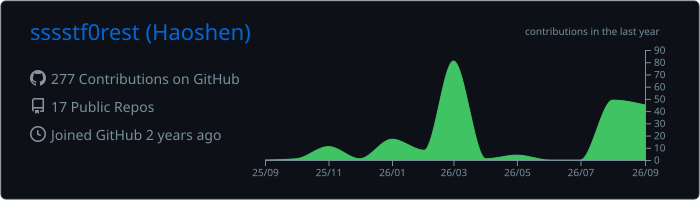

<!--
================================================================================
  FEATURE MENU — every section is numbered. Tell Claude which numbers to KEEP
  and the rest gets deleted.

   1  Animated typing banner            10  Contribution timeline  [in repo]
   2  Header + wave + side GIF          11  Activity graph            [down]
   3  Connect / social badges           12  Trophy case               [down]
   4  Visitor + follower counters       13  Contribution snake     [needs CI]
   5  Tech stack — skillicons           14  Top followers wall     [needs CI]
   6  Tech stack — shields badges       15  Repo gallery by stars  [needs CI]
   7  About / current focus             16  Latest blog posts      [needs CI]
   8  Featured work  [live badges]      17  Philosophy quote
   9  GitHub stats + streak  [in repo]  18  Footer / QR

  [needs CI] = renders broken until the companion workflow is added.
  [down]     = the free public instance is currently returning an error;
               self-host the project to make it work (see notes inline).
  Replace every  ⟨…⟩  placeholder with your own details.
================================================================================
-->

<!-- ═══════════════ 1 · ANIMATED TYPING BANNER ═══════════════ -->

<!-- ═══════════════ 2 · HEADER + WAVE + SIDE GIF ═══════════════ -->
## Hey there, I'm Forest :wave:

⟨One-line tagline — e.g. 🚀 Builder | 🤖 AI engineer | 🎯 Open-source enthusiast⟩

⟨Two or three sentences about who you are, what you build, and what you care
about. Keep it short — this is the part people actually read.⟩

> ⚡ ⟨A line about what you're exploring right now.⟩

 

<!-- ═══════════════ 3 · CONNECT / SOCIAL BADGES ═══════════════ -->
## 🤝 Connect

<!-- ═══════════════ 4 · VISITOR + FOLLOWER COUNTERS ═══════════════ -->

  
  
  

<!-- ═══════════════ 5 · TECH STACK — SKILLICONS ═══════════════ -->
## 🧰 Languages and Frameworks

<!-- Full icon list: https://skillicons.dev — just delete what you don't use.
     &theme=dark also works if you prefer the darker tiles. -->

## 🛠️ Tools and Environments

<!-- ═══════════════ 6 · TECH STACK — SHIELDS BADGES ═══════════════ -->
<!-- Alternative to #5 — text badges instead of icons. Pick one style, not both.
     Make your own at https://shields.io/badges/static-badge -->
## 🏷️ Skills

<!-- ═══════════════ 8 · FEATURED WORK ═══════════════ -->
## 🚀 Featured Work

<!-- Badges are served by shields.io and update themselves — no workflow needed.
     Swapped in after github-readme-stats.vercel.app went DEPLOYMENT_PAUSED.
     Add a project: copy a <td> block and change the repo name. -->

<table>
<tr>
<td width="50%" valign="top">

### [TabCloser](https://github.com/sssstf0rest/TabCloser)

A lightweight Windows tray app that closes Google Chrome tabs with a double-click.

</td>
<td width="50%" valign="top">

### [Open Bookmarks in New Tab](https://github.com/sssstf0rest/Open-Bookmarks-in-New-Tab)

A lightweight Chrome extension that opens bookmarks in a new tab without navigating away from the current page. Supports English and Chinese.

</td>
</tr>
</table>

<!-- ═══════════════ 9 · GITHUB STATS + STREAK ═══════════════ -->
## 📊 GitHub Activities

<!-- The stat + language cards are served from THIS repo, not a third-party host:
     .github/workflows/profile-summary-cards.yml regenerates them daily.
     No API token, no rate limits, and they cannot go down.
     Replaced the github-readme-stats.vercel.app cards, which returned
     503 DEPLOYMENT_PAUSED (the owner's free Vercel deployment is switched off).
     Swap "github_dark" for any of the 66 folders in profile-summary-card-output/. -->

<!-- Streak is a different host and is currently up. -->

## ✨ My Followers

<!-- NEEDS: a script + workflow that rewrites everything between these markers. -->
<!--START_SECTION:top-followers-->
<!-- Auto-generated avatar wall goes here. Empty until the workflow runs. -->
<!--END_SECTION:top-followers-->

<!-- ═══════════════ 15 · REPO GALLERY BY STARS  [needs CI] ═══════════════ -->
## 🌟 Open Source Projects

<!-- NEEDS: a script + workflow that queries the GitHub API and rewrites
     everything between these markers — featured gallery + full table. -->
<!-- PROJECTS:START -->
<!-- Auto-generated project gallery and star-ranked table go here. -->
<!-- PROJECTS:END -->

<!-- ═══════════════ 16 · LATEST BLOG POSTS  [needs CI] ═══════════════ -->
## ✍️ Latest Blog Posts

<!-- NEEDS: .github/workflows/blog-post-workflow.yml (gautamkrishnar/blog-post-workflow)
     pointed at your RSS feed. -->
<!-- BLOG-POST-LIST:START -->
<!-- Auto-generated post list goes here. -->
<!-- BLOG-POST-LIST:END -->

<!-- ═══════════════ 17 · PHILOSOPHY QUOTE ═══════════════ -->
## 💭 Philosophy

> ⟨A line you actually believe about how you build things.⟩

<!-- Or a rotating quote instead of a fixed one: -->

<!-- ═══════════════ 18 · FOOTER / QR ═══════════════ -->
---

<!-- Drop an image at ./assets/qr.png to use this: -->
<!--  -->

⭐️ From [sssstf0rest](https://github.com/sssstf0rest)

