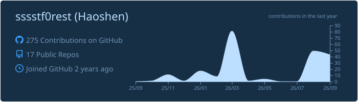

<!--
================================================================================
  FEATURE MENU — every section is numbered. Tell Claude which numbers to KEEP
  and the rest gets deleted.

   1  Animated typing banner            10  Contribution timeline  [in repo]
   2  Header + wave + side GIF          11  Activity graph            [down]
   3  Connect / social badges           12  Trophy case               [down]
   4  Visitor + follower counters       13  Contribution snake     [needs CI]
   5  Tech stack — skillicons           14  Top followers wall       [live]
   6  Tech stack — shields badges       15  Repo gallery by stars  [needs CI]
   7  About / current focus             16  Latest blog posts      [needs CI]
   8  Featured work  [live badges]      17  Philosophy quote
   9  GitHub stats + streak  [in repo]  18  Footer / QR

  [needs CI] = renders broken until the companion workflow is added.
  [live]     = generated in CI and committed to this repo; already working.
  [down]     = the free public instance is currently returning an error;
               self-host the project to make it work (see notes inline).
  Replace every  ⟨…⟩  placeholder with your own details.
================================================================================
-->

<!-- ═══════════════ 1 · ANIMATED TYPING BANNER ═══════════════ -->

<!-- ═══════════════ 2 · HEADER + WAVE + SIDE GIF ═══════════════ -->
## Hey there, I'm Haoshen :wave:

<!-- Tenor "Corgi Happy" (post 7614178), background removed and hosted here.
     The white backdrop was flood-filled to transparency from the borders, so
     the corgi's white chest and paws stay opaque; it now sits on GitHub's own
     background in both light and dark mode.
     Local file, so no dependency on Tenor. Regenerate: see git history.
     The tenor-gif-embed 
+<script> snippet does NOT work in a README —
     GitHub strips <script>, leaving only the fallback link. -->

I like building small gadgets — the fun kind that quietly make my life easier.

🏸 Badminton · 🎼 Ensemble Music · 🎴 ACG · 📷 Photography

> ⚡ Exploring the possibilities of AI and novel tools

<!-- ═══════════════ 4 · VISITOR + FOLLOWER COUNTERS ═══════════════ -->

  
  
  

 

<!-- ═══════════════ 3 · CONNECT / SOCIAL BADGES ═══════════════ -->
<!-- ## 🤝 Connect -->

<!-- 

 -->

<!-- ═══════════════ 4 · VISITOR + FOLLOWER COUNTERS ═══════════════ -->
<!-- 

  
  
  

 -->

<!-- ═══════════════ 5 · TECH STACK — SKILLICONS ═══════════════ -->
## 🧰 Languages and Frameworks

<!-- Full icon list: https://skillicons.dev — just delete what you don't use.
     &theme=dark also works if you prefer the darker tiles. -->

## 🛠️ Tools and Environments

<!-- ═══════════════ 6 · TECH STACK — SHIELDS BADGES ═══════════════ -->
<!-- Alternative to #5 — text badges instead of icons. Pick one style, not both.
     Make your own at https://shields.io/badges/static-badge -->
## 🏷️ Skills

<!-- ═══════════════ 8 · FEATURED WORK ═══════════════ -->
## 🚀 Featured Work

<!-- Generated by scripts/update_gallery.py, run daily at 03:00 UTC by
     .github/workflows/update-followers.yml. Ranked by stars; stats come from
     the GitHub API so they stay current.
     Do not hand-edit between the markers — it gets overwritten.
     Add or remove a project: edit the REPOS list in scripts/update_gallery.py
     Regenerate locally with:  python3 scripts/update_gallery.py -->
<!-- FEATURED:START -->
<table>
<tr>
<td width="50%" valign="top">
  <a href="https://github.com/sssstf0rest/Open-Bookmarks-in-New-Tab"><strong>Open-Bookmarks-in-New-Tab</strong></a> 
  A Lightweight Chrome extension that opens bookmarks in a new tab without navigating the current page. Supports English and Chinese (EN|CH)  
  
  
  
  
  
  
  
</td>
<td width="50%" valign="top">
  <a href="https://github.com/sssstf0rest/TabCloser"><strong>TabCloser</strong></a> 
  A lightweight Windows tray app that closes Google Chrome tabs with a double-click  
  
  
  
</td>
</tr>
<tr>
<td width="50%" valign="top">
  <a href="https://github.com/sssstf0rest/YouTube-in-New-Tab"><strong>YouTube-in-New-Tab</strong></a> 
  A lightweight Chrome extension that opens supported YouTube video links in a new adjacent tab instead of replacing the current page  
  
  
  
  
  
  
</td>
<td width="50%" valign="top">
  <a href="https://github.com/sssstf0rest/Open-Rubato"><strong>Open-Rubato</strong></a> 
  TODO — add a description on the repo page and this line disappears.  
  
  
  
</td>
</tr>
</table>
<!-- FEATURED:END -->

<!-- ═══════════════ 9 · GITHUB STATS + STREAK ═══════════════ -->
## 📊 GitHub Activities

<!-- The stat + language cards are served from THIS repo, not a third-party host:
     .github/workflows/profile-summary-cards.yml regenerates them daily.
     No API token, no rate limits, and they cannot go down.
     Replaced the github-readme-stats.vercel.app cards, which returned
     503 DEPLOYMENT_PAUSED (the owner's free Vercel deployment is switched off).
     Using the "prussian" theme: light-blue graph on a dark navy card.
     Note this is a solid card, so it reads as a dark block in light mode —
     "transparent" was the mode-adaptive option if you want that back.
     Swap for any of the 66 folders in profile-summary-card-output/.

     Now pointing at the project's HOSTED endpoint instead of the local SVG,
     so it renders live and needs no workflow run. Tradeoff: it is a
     third-party service, so it can go down — the commented-out local path
     above always works. Same theme names apply to both. -->

<!--  -->

## ✨ My Followers

<!-- Generated by scripts/update_followers.py, run daily at 03:00 UTC by
     .github/workflows/update-followers.yml. Sorted by each follower's own
     follower count. Do not hand-edit between the markers — it gets overwritten.
     Tune PER_ROW / MAX_SHOWN in the workflow's env block.
     Regenerate locally with:  python3 scripts/update_followers.py -->
<!--START_SECTION:top-followers-->
<table>
  <tr>
    <td align="center">
      
       
      <a href="https://github.com/helallao"><b>Ali Yaşar</b></a>
    </td>
    <td align="center">
      
       
      <a href="https://github.com/seckinyasar"><b>Seckin Yasar</b></a>
    </td>
    <td align="center">
      
       
      <a href="https://github.com/ipqwery"><b>IPQuery</b></a>
    </td>
    <td align="center">
      
       
      <a href="https://github.com/bludnic"><b>bludnic</b></a>
    </td>
    <td align="center">
      
       
      <a href="https://github.com/sarahofai"><b>Blue</b></a>
    </td>
    <td align="center">
      
       
      <a href="https://github.com/vibecodinguy"><b>Vibecodinguy</b></a>
    </td>
  </tr>
  <tr>
    <td align="center">
      
       
      <a href="https://github.com/Ari4ka"><b>Ari4ka</b></a>
    </td>
    <td align="center">
      
       
      <a href="https://github.com/sakshamsharma9927729250-beep"><b>Saksham Sharma</b></a>
    </td>
    <td align="center">
      
       
      <a href="https://github.com/Ganes-Sargar"><b>GANESH SARGAR</b></a>
    </td>
    <td align="center">
      
       
      <a href="https://github.com/nuclearrockstone"><b>STONE ZHAO</b></a>
    </td>
    <td align="center">
      
       
      <a href="https://github.com/lilyNeema"><b>Susan Neema</b></a>
    </td>
  </tr>
</table>
<!--END_SECTION:top-followers-->

